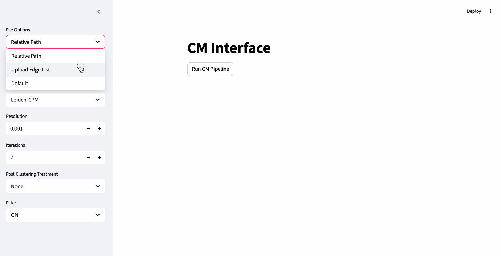

# CM API
This is a GUI wrapper for CM, or [Connectivity Modifier](https://github.com/illinois-or-research-analytics/cm_pipeline/tree/main), that enables the use of CM pipeline directly through a user-friendly web interface.


CM citations:
- Park, Minhyuk, Yasamin Tabatabaee, Vikram Ramavarapu, Baqiao Liu, Vidya Kamath Pailodi, Rajiv Ramachandran, Dmitriy Korobskiy, Fabio Ayres, George Chacko, and Tandy Warnow. "Well-connectedness and community detection." PLOS Complex Systems 1, no. 3 (2024): e0000009.
- Ramavarapu, Vikram, Fábio Jose Ayres, Minhyuk Park, Vidya Kamath Pailodi, João Alfredo Cardoso Lamy, Tandy Warnow, and George Chacko. "Cm++-a meta-method for well-connected community detection." Journal of Open Source Software 9, no. 93 (2024): 6073.

## How to run
Run the following command inside the folder where the repository was cloned. The URL where the GUI is hosted will be printed in the terminal.
```bash
docker compose up
```


## (Recommended) Docker Setup

```bash
git clone https://github.com/alfredjynx/GUI-CM.git
cd GUI-CM
git submodule update --init --recursive
docker compose up
```

## (Not recommended) Local installation
Local installation requires the user to setup the backend API and interface locally. The user is responsible for making sure that all required dependencies are met.
### Requirements
- **Operating System**: macOS or Linux
- **Python**: Version 3.9 or higher
- **CMake**: Version 3.2.0 or higher
- **GCC**: 10 or higher
- **R**: With the following packages:
  - `data.table`
  - `feather`
- (optional): graph-tool package needed for SBM analyses


#### Example local Setup Instructions
Here is an example set of commands on a machine that has all of the required and optional dependencies installed.
      ```bash
git clone https://github.com/alfredjynx/GUI-CM.git
cd GUI-CM
git submodule update --init --recursive
cd cm_pipeline
pip install -r requirements.txt
cd ..
pip install -r requirements.txt
cd api
uvicorn main:app &
cd ../interface-prototype
streamlit run home.py &
```

Now the interface server should be running locally.
