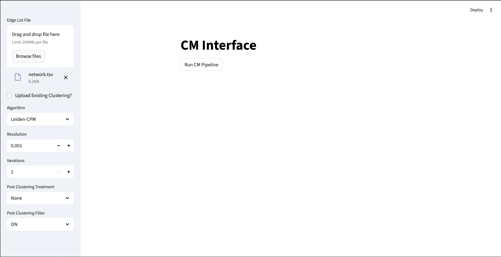

# Lesson 3 - Using the GUI

In this lesson we'll be explaining how to use the CM-GUI, with examples and images.

## Launching the GUI


## Uploading a Network

First, launch the GUI using you preferred method (either Docker or local install).

There is a folder `/lessons/example_data` with a simple network edge list.

The `network.tsv` file has no headers and two columns, a `Source` and a `Target` column. The first column is the `Source` and the second one is the `Target` node. Their values are the Node IDs of the respective connected nodes. They represent the edge between two different node. This type of file is known as an **Edge List**.

That's what we'll be using as our input for the GUI.

In the sidebar, there is a box called **Edge List File**, with text that says *Drag and Drop File Here*. Upload your file there.


After this, you should be ready to run your first clustering. 

The next step is selecting a clustering algorithm.


## Clustering Algorithms

The GUI supports 4 different Algorithms:

- Leiden CPM
- Leiden Modularity
- Infomap
- Stochastic Block Model (SBM)


### Leiden (CPM and Modularity)

Leiden is an algorithm which is built upon the [Louvain clustering method](https://en.wikipedia.org/wiki/Louvain_method). 

The Leiden algorithm employs an intermediate refinement phase in which communities may be split to guarantee that all communities are well-connected.

In our GUI, we have 2 different versions of Leiden available. 


#### Leiden CPM (Constant-Potts Model)

Used when:

```python
algorithm == 'Leiden-CPM'
```

**Parameters:**

* `Resolution` (`res`) – *float*
  Controls the resolution parameter $\gamma$ for Constant Potts Model.
* `Iterations` (`i`) – *int*
  Number of times the Leiden CPM algorithm is run.


Varying the Resolution Parameter may result in clusterings of different sizes and connectivity score. Higher resolution values tend to produce fewer more densily connected clusters, with a lower node coverage. Lower resolution values tend to produce bigger clusters that are not as densily connected, with a higher node coverage.


#### Leiden-Mod

Used when:

```python
algorithm == 'Leiden-Mod'
```

**Parameters:**

* `Iterations` (`i`) – *int*
  Number of times the modularity-based Leiden algorithm is run.


This is closest to the Louvain Method for community detection. The modularity of the community is the relative density of edges inside communities with respect to edges outside communities.


### Infomap

No need to pass parameters via GUI, only the input files.

The Infomap Clustering method is based on the [Map Equation](https://www.mapequation.org/publications.html#Rosvall-Axelsson-Bergstrom-2009-Map-equation). This equation minimizes something called the Description Lenght of a random walk in the network


### Stochastic Block Model (SBM)

Used when:

```python
algorithm == 'Stochastic Block Model (SBM)'
```

**Parameters:**

* `Block state` (`block_state`) – *str*
  Determines the variant of SBM:

  * `"Non Nested"`
  * `"Planted Partition Model"`
* `Degree corrected` – *bool*
  *(Only available if `"Non Nested"` is selected)*
  Whether to use the degree-corrected version of SBM.

## Selecting an Algorithm

The sidebar has a drop-down menu with the algorithm options, it should be set to "Leiden-CPM" as default.


Leave it with the deafult options, for now. Your sidebard should look like this:



## Run the GUI

Just press the `Run CM Pipeline` button below the **CM Interface** title.

When the CM Pipeline is finished running, the GUI should update the page to look like this:


Now, download the Clustering Data.

It's a file with two columns and no headers. The first column has Node IDs, and the second has their corresponding cluster/community ID. 

It's important to mention that not all nodes are allocated to a community. The proportion of nodes in communities to all nodes is called **Node Coverage**.