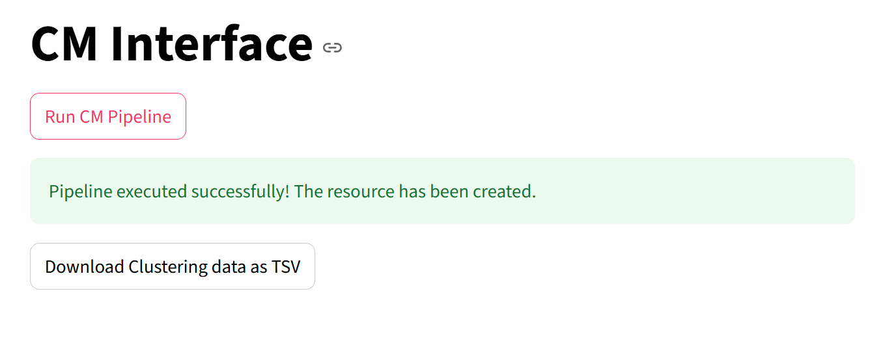

# Lesson 3 - Using the GUI

In this lesson we explain how to use the CM-GUI.

## Launching the GUI

[someone fill in text please?]

## Uploading a Network

First, launch the GUI (either Docker or local install).

The `network.tsv` file in `/lessons/example_data` is an **edge list**. It does not have a header row and consists of two columns of node_ids corresponding to `Source` and  `Target`.  Each row represents an edge between two nodes. We will use this edge list as input to the GUI.

In the sidebar of the GUI, note a box labeled **Edge List File**, with text that says *Drag and Drop File Here*. Drag the network.tsv file there.


You should now be ready to run your first clustering and the next step is selecting a clustering algorithm.

## Clustering Algorithms

The GUI supports 4 different clustering algorithms:

- Leiden CPM [reference]
- Leiden Modularity [reference]
- Infomap [reference]
- Stochastic Block Model (SBM) [reference]

### Leiden (CPM and Modularity)

Leiden is an algorithm which is built upon the [Louvain clustering method](https://en.wikipedia.org/wiki/Louvain_method). The Leiden algorithm employs an intermediate refinement phase in which communities may be split to guarantee that all communities are well-connected.

In this GUI, two different versions of Leiden are available. 


#### Leiden CPM (Constant-Potts Model)

Used as:

```python
algorithm == 'Leiden-CPM'
```

**Parameters:**

* `Resolution` (`res`) – *float*
  Controls the resolution parameter $\gamma$ for Constant Potts Model.
* `Iterations` (`i`) – *int*
  Number of times the Leiden CPM algorithm is run.

Varying the Resolution Parameter typically results in clusters of different sizes and connectivity. Higher resolution values tend to produce smaller and more densely connected clusters. Lower resolution values tend to produce larger clusters that are not as densily connected, with a higher node coverage. [reference]


#### Leiden-Mod

Used as:

```python
algorithm == 'Leiden-Mod'
```

**Parameters:**

* `Iterations` (`i`) – *int*
  Number of times the modularity-based Leiden algorithm is run.


Leiden-Mod  is closest to the Louvain Method for community detection. The modularity of the community is the relative density of edges inside communities with respect to edges outside communities.

### Infomap

The Infomap Clustering method is based on the [Map Equation](https://www.mapequation.org/publications.html#Rosvall-Axelsson-Bergstrom-2009-Map-equation). This equation minimizes something called the Description Lenght of a random walk in the network.

No parameters are passed via GUI, only the input files.

### Stochastic Block Model (SBM)

Used as:

```python
algorithm == 'Stochastic Block Model (SBM)'
```

**Parameters:**

* `Block state` (`block_state`) – *str*
  Determines the variant of SBM:

  * `"Non Nested"`
  * `"Planted Partition Model"`
* `Degree corrected` – *bool*
  *(Only available if `"Non Nested"` is selected)*
  Whether to use the degree-corrected version of SBM.

## Selecting an Algorithm

The sidebar has a drop-down menu with the algorithm options, it should be set to "Leiden-CPM" as default.


Leave it with the deafult options, for now. Your sidebard should look like this:


## Run the GUI

Click on the `Run CM Pipeline` button below the **CM Interface** title.

When the CM Pipeline is finished running, the GUI should update the page to look like this:



Now, download the Clustering Data. [what is this file named?]

It's a file with two columns and no headers. The first column consist of node_ids, and the second is the corresponding cluster/community ID for a node.

The proportion of nodes in communities or clusters containing at least two nodes is termed **Node Coverage**.
