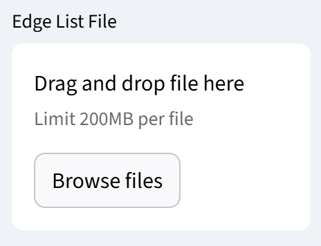
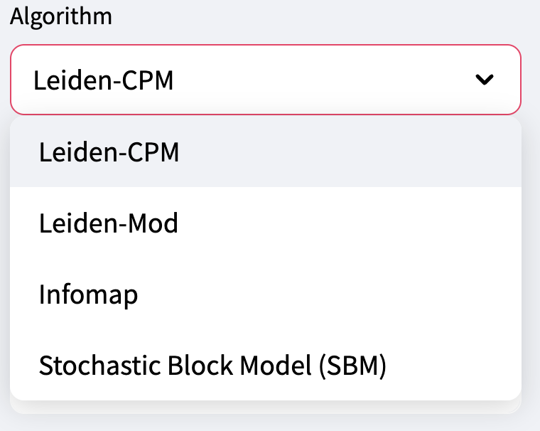
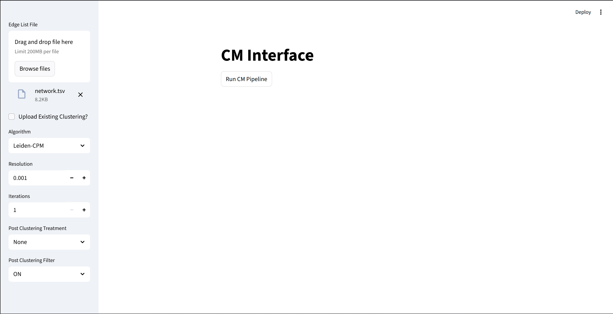
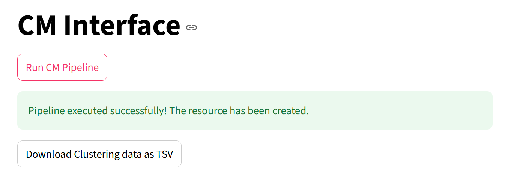

# Lesson 4 - Using the GUI with an External Network

In this lesson we explain how to translate a network to work with the CM-GUI.

## Launching the GUI

Please see Lesson 2 or the repo `README.md` file for launch instructions.

## Downloading a Network

### Cit-HepPh

We'll be using the [Stanford High-energy Physics Citation Network](https://snap.stanford.edu/data/cit-HepPh.html) for this experiment. Please download `cit-HepPh.txt.gz` and save the `Cit-HepPh.txt` to your local machine.

If we take a look at the `network.tsv` file present in `/lessons/example_data`, it is a tab separated edge list that has no header, meaning no column names. It consists of two columns of node ids corresponding to `Source` and  `Target`.

The file just downloaded is different from the usual input. It has 4 commented out lines that explain the network and what the edge list is. It should look like this:

```
# Directed graph (each unordered pair of nodes is saved once): Cit-HepPh.txt 
# Paper citation network of Arxiv High Energy Physics category
# Nodes: 34546 Edges: 421578
# FromNodeId	ToNodeId
9907233	9301253
9907233	9504304
9907233	9505235
```


For the GUI to work, the input edge list needs to be a tab separated edge list that has no header or comments. Please, delete the first 4 lines of the downloaded edge list, leaving only the node ids.

```
9907233	9301253
9907233	9504304
9907233	9505235
9907233	9506257
9907233	9606402
9907233	9607354
9907233	9611297
```


## Uploading a Network

In the sidebar of the GUI, note a box labeled **Edge List File**, with text that says *Drag and Drop File Here*. Drag the `Cit-HepPh.txt` file there.



You should now be ready to run a clustering job.

## Clustering Algorithms

The GUI supports 4 different clustering algorithms:

- Leiden CPM [Traag et. Al](https://www.nature.com/articles/s41598-019-41695-z)
- Leiden Modularity [Traag et. Al](https://www.nature.com/articles/s41598-019-41695-z)
- Infomap [reference]
- Stochastic Block Model (SBM) [reference]

## Selecting an Algorithm

The sidebar has a drop-down menu with the algorithm options, it should be set to "Leiden-CPM" as default.



Leave it with the deafult options, for now. Your sidebard should look like this:



## Run the GUI

Click on the `Run CM Pipeline` button below the **CM Interface** title.

When the CM Pipeline is finished running, the GUI should update the page to look like this:



Now, download the Clustering Data `leiden.tsv`.

It's a file with two columns and no headers. The first column consist of node_ids, and the second is the corresponding cluster/community ID for a node.

The proportion of nodes in communities or clusters containing at least two nodes is termed **Node Coverage**.

## Other Input Networks

Stanford has a collection of different networks you can use to study clustering methods, they're available [here](https://snap.stanford.edu/data/).

All of these datasets need to be modified to meet the specific input format required by the GUI, leaving only a tab separated, two-column file that has node ids as values and no headers.