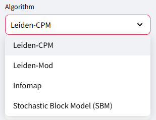

# Introduction
Community detection in networks has broad applications [@Fortunato2022]. Beyond the intuitive expectation that communities have greater edge density relative to network background, an important, but sometimes overlooked, quality of "good clusters" is that they should be internally well-connected [@park2024well;@traag2019louvain]. Post-clustering techniques such as the Connectivity Modifier (CM) [@park2024well;@Ramavarapu2024] and Well-Connected Clusters (WCC) [@park2024improved] modify a clustering to ensure that all clusters meet a minimum standard defined by their mincut. Here, we present a simple user-friendly graphical user interface (GUI) that reduces the burden of installation and the complexity of command line operations for non-expert users. The GUI enables a user to cluster a network and perform a post-treatment to enforce well-connectedness of clusters.

# Background
## The CM pipeline
CM was designed to enforce well-connectedness in clusters generated during a community detection process [@park2024well;@Ramavarapu2024]. The basis by which a cluster is considered well-connected is defined by the size of its min-cut, the smallest set of edges that need to be removed in order for the cluster to be split. In the CM pipeline, if the min-cut of a cluster is above a user-specified threshold, a cluster is considered well-connected. If not, then the min-cut is removed and the products of the cut (two clusters) are re-clustered and re-tested for their min-cuts until every community is well-connected. The threshold specified in [@park2024well] is a mild standard of $log_{10}n$, with $n$ being the number of nodes in the cluster but the pipeline allows users to specify their own criteria through custom functions.

## Well-Connected Clusters
<!-- WCC is a simple modification of CM that omits the reclustering step.  In WCC, clusters are repeatedly split into two clusters until each cluster satisfies the required connectivity bound. [@park2024improved]. WCC is a viable alternative to post-processing with CM if re-clustering the subclusters is not desired. We illustrate in \autoref{fig:cpm-wcc} the effect of WCC on a Leiden-CPM clustering with resolution value 0.01. The initial Leiden clustering results in merging adjacent cliques into a single cluster (left: five green cliques) on a ring-of-cliques network with 40 6-cliques. This is corrected through WCC post-treatment which enforces internal well-connectedness for each cluster. -->
One use of the WCC or CM post-treatment is to address the “resolution limit” [@fortunato2007resolution], which is where a clustering method is unable to find the valid communities that are too small for the method.  The classical example is a ring of cliques, where each pair of adjacent cliques are connected by a single edge.  As established in [@fortunato2007resolution], for large enough numbers of cliques, modularity clustering will group adjacent cliques into single clusters, which is a failure to detect the obvious communities. Here we show that the same problem occurs for Leiden-CPM, given a ring of 40 cliques, each of size 6.  Before CM or WCC, Leiden-CPM will group 5 of the cliques together into a single cluster, but following with CM or WCC post-treatment breaks up these incorrect clusters so that only the cliques are returned as clusters (\autoref{fig:cpm-wcc}).

<!-- {height="150pt"} -->

<!-- {height="150pt"} -->

![\textbf{Leiden-CPM(0.01) without and with WCC treatment on a ring-of-cliques network (40 cliques with 6 nodes each)} Left: Zoomed in view of Leiden-CPM with resolution value 0.01. Right: Zoomed in view of Leiden-CPM with resolution value 0.01 and post-treated using WCC. The visualization uses colors to denote different clusters. Leiden-CPM by itself merges adjacent cliques into a single large cluster whereas WCC post-treatment is able to separate out individual cliques into their own clusters.  \label{fig:cpm-wcc}](./imgs/cpm_wcc_side_by_side.png){height="150pt"}

# Statement of need
Clustering has broad applications. The selection of a clustering method and choice of parameter settings is often assisted by exploratory analysis. A user-friendly GUI enables such initial exploratory analysis and lowers the barrier for entry. The GUI described here can also be used as an instructional tool in introductory classes on community detection.

# The GUI
## GUI Architecture
The GUI is modularized into front-end and back-end components. The GUI is implemented in Python leveraging Streamlit [@streamlit] for the front-end and FastAPI [@ramirez_fastapi_2018] for the back-end and supports **remote hosting** on a website. We show in \autoref{fig:gui-interface} the main interface for the GUI.

{height="180pt"}

In \autoref{fig:gui-options}, we show the different clustering options available in the GUI. At present, support is provided for 4 different clustering algorithms: Leiden-CPM (Constant Potts Model) [@traag2019louvain;@traag2011narrow], Leiden-Modularity [@traag2019louvain], Infomap [@Rosvall2008], and Stochastic Block Models (SBM) [@peixoto_graph-tool_2014]. Each algorithm takes a set of parameters that must be specified before running the pipeline. The parameters are explained in the CM pipeline documentation and in the CM-GUI documentation.

The user is required to upload a network as an edge list, which is then clustered using the method selected by the user, after which well-connectedness is enforced. The user may also upload a pre-computed clustering of the network and skip the initial clustering stage of the CM pipeline.  Results can be downloaded at the end of the run by clicking the "Download Clustering data as CSV" button.

<!-- {height="150pt"} -->

<!-- {height="150pt"} -->

{height="150pt"}

## Installing the GUI
To install the CM pipeline GUI, the user has two options: via Docker or a manual install.

We recommend the Docker install as it simplifies installation of necessary packages for running the GUI. A local installation option without Docker is available and described in the README of the repository.
<!-- The Dockerfile and docker-compose files automate the process of installing every required package inside a virtual machine, making it accessible to more users and across operating systems. If the user chooses to install every required package locally, the back-end and front-end need to be run in separate terminals. In both cases, the user can access the GUI via the front-end URL. -->

# Conclusions
The GUI makes the CM pipeline accessible to entry-level users and can be used as an instructional tool. The size of the networks that can be handled by this GUI depend on the hardware that it is installed on. Future work planned will include retrieving basic cluster statistics and visualizations through the GUI on the clusterings produced.

# Acknowledgements
We would like to thank Ian Wei Chen and The-Anh Vu-Le for their help in testing the software. Work on this project was supported by funds from the Illinois-Insper Partnership.

# References
<!-- 
1. Ramavarapu et al., (2024). CM++ - A Meta-method for Well-Connected Community Detection. Journal of Open Source Software, 9(93), 6073, https://doi.org/10.21105/joss.06073

2. Park, M. et al. (2024). Identifying Well-Connected Communities in Real-World and Synthetic Networks. In: Cherifi, H., Rocha, L.M., Cherifi, C., Donduran, M. (eds) Complex Networks & Their Applications XII. COMPLEX NETWORKS 2023. Studies in Computational Intelligence, vol 1142. Springer, Cham. https://doi.org/10.1007/978-3-031-53499-7_1

3. Park, Minhyuk, Daniel Wang Feng, Siya Digra, The-Anh Vu-Le, George Chacko, and Tandy Warnow. "Improved Community Detection using Stochastic Block Models." In International Conference on Complex Networks and Their Applications, pp. 103-114. Cham: Springer Nature Switzerland, 2024. https://link.springer.com/chapter/10.1007/978-3-031-82435-7_9

4. Traag, V. A., Waltman, L., & Van Eck, N. J. (2019). From Louvain to Leiden: guaranteeing well-connected communities. Scientific reports, 9(1), 1-12.

5. Traag, V. A., Van Dooren, P., & Nesterov, Y. (2011). Narrow scope for resolution-limit-free community detection. Physical Review E—Statistical, Nonlinear, and Soft Matter Physics, 84(1), 016114.

6. Rosvall, M., & Bergstrom, C. T. (2008). Maps of random walks on complex networks reveal community structure. Proceedings of the national academy of sciences, 105(4), 1118-1123.

7. Peixoto, T., “The graph-tool python library”, figshare. (2014) DOI: 10.6084/m9.figshare.1164194

8. Fortunato, S., Newman, M.E.J. 20 years of network community detection. Nat. Phys. 18, 848–850 (2022). https://doi.org/10.1038/s41567-022-01716-7

9. Ramírez, S. (2018). FastAPI. Retrieved from https://fastapi.tiangolo.com/

10. Streamlit Inc. (2019). Streamlit. Retrieved from https://streamlit.io/ -->
